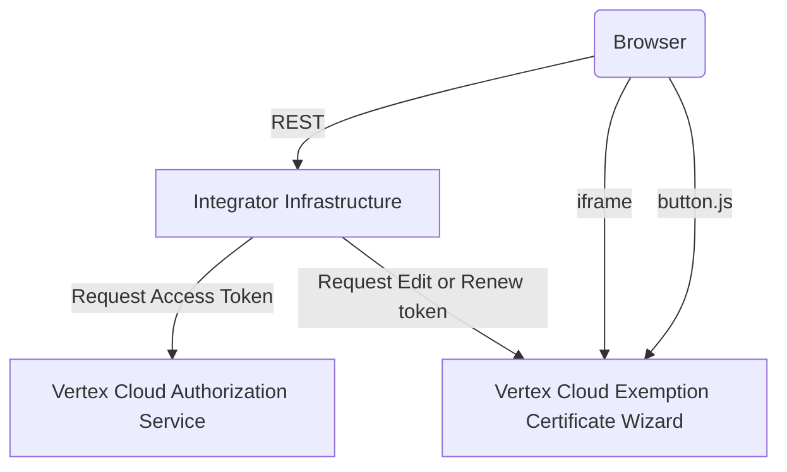

# vcd-ecw-demo-portal
Demo and sample application for Exemption Certificate Wizard integrations.

## Requirements
In order to run the demo, you must have a current version of nodejs installed.  Please go to https://nodejs.org, and download either the LTS or Current version and install.

>This application was developed against v10.16.1.

## Getting ECW sample application
### If your source is GitHub
```bash
$ git clone https://github.com/vertexinc/vcd-ecw-demo-portal.git
```
### If your source is a Zip File
```bash
$ unzip vcd-ecw-demo-portal.zip
```

## Installing (Get dependencies)
From the command line at root of project

```bash
$ cd vcd-ecw-demo-portal
$ npm install
```

## Starting the Server
From the command line at root of project
```bash
$ npm start
```

## Viewing Demo
With the default settings, you should be able to browse to ```http://localhost:4290```.  
>NOTE: The site will require you to log in. We did this so that we can set specific buyer codes, and overrides per login.  **Password is required, however you can type anything in.**  It doesn't actually do any authentication.

>Since this demo was developed with integrators in mind and not for public consumption, no attempt was made to ensure browser compatibility. We didn't want to needlessly complicate the sample with the infrastructure required for transpilation. All development was done against the latest Chrome and Firefox releases, using vanilla javascript.


## Overview
### Diagram ([mermaid](https://github.com/knsv/mermaid))
Link to view: [Diagram](https://tinyurl.com/y3hmesa7)


>```ClientID``` and ```Secret``` that represent your integration should never be stored on the client or accessible to the public.  It's recommended that the ```access_token``` should not be stored in a cookie or localStorage.  It's best to keep it in memory and passed into the Wizard.

### Requesting an Access Token
You will find an example of this in ```/services/ecw-auth.js```.  It is highly recommended you make calls against the authorization service from your back-end systems.

### Requesting an Edit Token
You will find an example of this in ```/services/ecw.js```. It is highly recommended you make calls against the authorization service from your back-end systems. 

### Launching the Wizard in the Browser
You will find an example of this in ```./client/scripts/ecw-integration.js```.  ```initializeWizard``` returns an object with a function called ```bindWizard``` that can be used to bind the Wizard launch to the button click of the provided DOM element.


## Settings
You will find the settings in the ```config``` folder, under ```settings.toml```
### Setting Section: service
Under service, you will find custom ```port``` number, as well as ```show_token_timeout```.  Use this setting to display a countdown for the life of the access_token.

### Setting Section: ecw
With the exception of ```wizard_base_address```, all settings in this section are sensitive, and shouldn't be directly exposed on the client in HTML or Javascript.

|Setting|Description|
|---|---|
|client_id | Used to identify Wizard client|
|client_secret | Used in conjunction with client_id to authorize client, using OAUTH2.0 client credential grant type|
|seller_code | Identifies the taxable entity |
|client_code | Identifies the Client |
|auth_endpoint | OIDC Service token endpoint |
|wizard_base_address | ECW service base url|

### Setting Section: users
Used to set up users for the Demo site.

## Files & Folders
>The important bits running in the browser are in ```client/scripts/ecw-integration.js``` and on the server side in ```services/ecw*.js```.  The rest is basically plumbing.

|Name|Description|
|---|---|
|client|Browser files: ecw-integration.js has the sample code for driving the wizard |
|config|Contains configuration TOML file|
|controllers|Endpoint implementations|
|services|ecw.js contains service code to support wizard operations|
|views| HTML templates|
|routers.js|Endpoint definition|
|server.js|Sets up the web application framework and middleware components|

## VSCODE
Visual Studio Code combines the ease of use of a classic lightweight text editor with more powerful IDE-type features with very minimal configuration, it “just works”.
### Recommended Plugins
* ESLint
* Better TOML
* Nunjucks
* Markdown Preview Mermaid Support

### Debug Configuration
```json
    "configurations": [
        {
            "type": "node",
            "request": "launch",
            "name": "Launch Program",
            "program": "${workspaceFolder}\\server.js"
        }
    ]
```

## Dependencies
| Dependency  | Purpose  | 
|---|---|
|  koa | Web application server |  
|  @koa/router  | Router middleware for koa  |   
|  koa-bodyparser | Body parsing middleware for Koa   |   
|  koa-static |  Static file server middleware for koa |   
|  koa-views | Template rendering middleware for koa   |   
|  nunjucks | Template engine |   
|  superagent| Used as server side REST client |   
|  toml | Used to parse server settings  |   

## Attributions
- https://commons.wikimedia.org/wiki/File:738-nut-and-bolt.svg
- https://github.com/koajs/router
- https://github.com/koajs/bodyparser
- https://github.com/koajs/static
- https://github.com/koajs/koa
- https://github.com/queckezz/koa-views
- https://github.com/mozilla/nunjucks
- https://github.com/visionmedia/superagent
- https://github.com/BinaryMuse/toml-node


